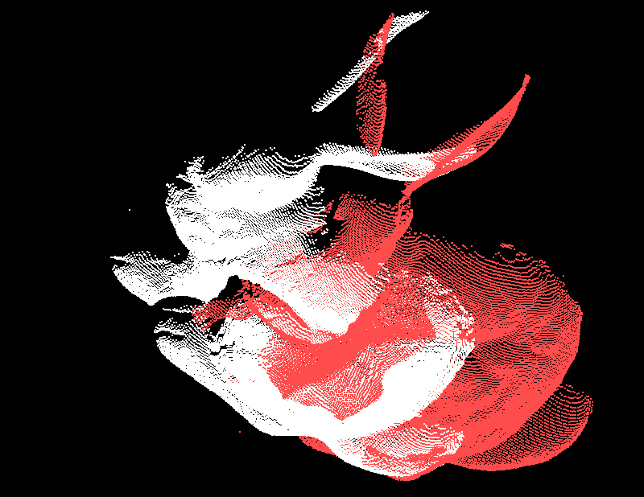

 

  

CUDA Iterative Closest Point
======================

**University of Pennsylvania, CIS 565: GPU Programming and Architecture, Project 4**

* Author: Chhavi Sharma ([LinkedIn](https://www.linkedin.com/in/chhavi275/))
* Tested on: Windows 10, Intel Core(R) Core(TM) i7-6700 CPU @ 3.40GHz 16GB, 
             NVIDIA Quadro P1000 4GB (MOORE100B-06)

### Index

- [Introduction]( )
- [Algorithm]( )
- [Implementation Details]( )
- [Analysis]( )
- [Future Work] ()
- [Some More Results and Bloopers]( )
- [Resources and References]( )

### Introduction 

In this project, we show different optimzations of the iterative closest point algorithm which can be used to align partially overlapping point clouds of different views of an object. Operations in ICP on large point clouds are highly parallelizable which makes it a good candiate for CUDA based implemantion and optimization.

[Iterative closest point algorithm](https://en.wikipedia.org/wiki/Iterative_closest_point) successively estimates and applies rotation and transaltion between two sets of point clouds of different views of an object to achieve the closest alignment. 
The algorithm iteratively revises the transformation needed to minimize the distance between corresponding points across the two point clouds. ICP depends on an initial guess of the *rigid body transformation* (Rotation and translation) to acheive good results in case of drastically different views of objects.

### Algorithm
Given:
 - P : M Source points 
 - X : N Target points
 
At each iteration:
 - FOr each point in the source, find the closest correspoding point in y based on some metric. We use minimum euclidian distance to assign the closest point.
 - Now, for a set of correspondances, we estimation the rotation and transaltion between them by solving the [orthogonal procrustes problem](https://en.wikipedia.org/wiki/Orthogonal_Procrustes_problem). The prblem can be formulated as finding the best Rotation and Translation that minimises the average distance between the source and the target points. This optimization can be solved by solving the least squares problem, with the solution being the SVD of the matrix product of the source and target. More precisely: 

  

   

  
  
  

 - We do this by mean centring the source and target corrspondances, and then computing the matrix W= transpose(Xmeancntred)* Pmeancntred. Then, the Rotation is U * Transpose(V) where singualr value decomposition of W, ie.e SVD(W) = USV. Translation,T is Xmean-R * Pmean.      
 - Reapeat until convergence i.e. when predicted Rotation matrix is identity and translation is close to zero.
       

### Implementation Details

Three variations of ICP on have been implmented:
   - [x] CPU Iterative Closest Point  
   - [x] GPU Iterative Closest Point with Naive Search
   - [x] GPU Iterative Closest Point with KDTree Search

     CPU     |     GPU Naive     |     GPU KDTree     

   
   	
   

  

#### CPU Iterative Closest Point  
The CPU implementation uses the steps in the above algorithm to iteratively apply roation andtranlation on source data. The correnpondance computation requires an O(M) search for each element in the source point cloud. This is done naively on th CPu where each source points looks through the entire traget set to compute the closest correpondence. 

#### GPU Iterative Closest Point with Naive Search
The CPU implementation is optimised by using a CUDA kernel to perfrom the coresspondance search. Each element in the source point cloud now finds a correspondance in the target point cloud in parallel. Even though this approach is much faster than the CPU version, each point still goes through the entire target data set to pick the closest point.

#### GPU Iterative Closest Point with KDTree Search
We further optimize each iteration by optimizing the search per source point. We implement a KD-tree structure to search the target 3D point cloud data. A kd tree is a binary tree in which every leaf node is a k-dimensional point. Every non-leaf node can be thought of as implicitly generating a splitting hyperplane that divides the space into two parts, known as half-spaces. Points to the left of this hyperplane are represented by the left subtree of that node and points to the right of the hyperplane are represented by the right subtree. 

   
   

    
The average search time on a KD tree for target data of size n is O(log(n)).

The K-D tree is constructed on the CPU and the stored in a contiguous linear level-order traveral format. It is then transfered to the GPU where the search travel is iterative rather than recursive. CUDA does not support very deep recursiions and therfore an iterative traversal technique to perfrom nearest neighbour search on the KD tree is implemented. To facilitate iterative traveral and backtracking over the tree, a book-keeping array is also maintained. The pseudo code for Nearest neighbour search in KD tree is as follows:-

   

 

 Search Improvment (Runtime)

 CPU    -> GPU Naive -> GPU KDTree 

 O(M*N) ->   O(N)    -> O(log(N))   

#### Iterative Rendering
The point cloud data is also rendered iteratively to show the chages made by the application of each rotation and translation predicted by the algorithm. This shows that the source object is slowing moving towards the target as a rigid body.

   
   
   	

  

### Analysis

The time taken per iteration for the above three cases on the point cloud data of partially overlapping views of the 'Stanford Bunny' is plotted below:-

   
   

  

The data does not have perfect correspondances, and therefore the plots never completely overlap. In most real applications of ICP, the data only has partal overlap and therfore this is a good example set.

 - The GPU Naive perfromsbetter than CPU ecuase each element is the source looks of the Nearrest neighbour in the target paralelly on CUDA.

 - In K-D tree seach, the time taken per iteration reduces as the point cloud aligns better with the target.
The initial iterations KDtree is slower since the source and target points are highly miss-aligned and each search call goes over the entire tree (worst case time) to find the best neighbour. As the source getss aligned better with the target, the correspondences are found earlier in the tree traversal and the runtime reduces.

 - However, we see a that the best time on GPU Naive is better than GPU KD-Tree on the current dataset. Even though GPU KD Tree should be theoratically faster (log(n)), the memory overheads of traversing the tree in the current implementation dominate the runtime when the number of points are not very large. The tree traversal is also *non-contiguous* memory access which causes more fetaches from the global memory than the naive implementation here the search is on contiguous memeory and hence is faster. Therefore, on this dataset the KD tree traversal converges at a higher runtime than the naive approach. The naive search accesses more data but contiguously, whereas, KD tree search jumps around nodes, looking at non-contiguous data and thus takes more time even with lesser comaprasions. 

### Bloopers
Error in the Rotation computation deformed the point cloud and ICP never converged:

   

  

Drastic differnce in point clouds causes ICP to misalign data:

   

  

### Resources and References 
[icp.pdf](http://ais.informatik.uni-freiburg.de/teaching/ss11/robotics/slides/17-icp.pdf)  
[wiki/K-d_tree](https://en.wikipedia.org/wiki/K-d_tree)  
[k-d-trees](https://blog.krum.io/k-d-trees/)   
[cmu.kdtrees.pdf](https://www.cs.cmu.edu/~ckingsf/bioinfo-lectures/kdtrees.pdf)  
[cmu.kdrangenn](https://www.cs.cmu.edu/~ckingsf/bioinfo-lectures/kdrangenn.pdf)  
[gfg.k-dimensional-tree](https://www.geeksforgeeks.org/k-dimensional-tree/)  
[GTC-2010/pdfs/2140_GTC2010.pdf](https://www.nvidia.com/content/GTC-2010/pdfs/2140_GTC2010.pdf)  
[s10766-018-0571-0](https://link.springer.com/article/10.1007/s10766-018-0571-0)  
[nghiaho.com](https://nghiaho.com/?p=437)  

